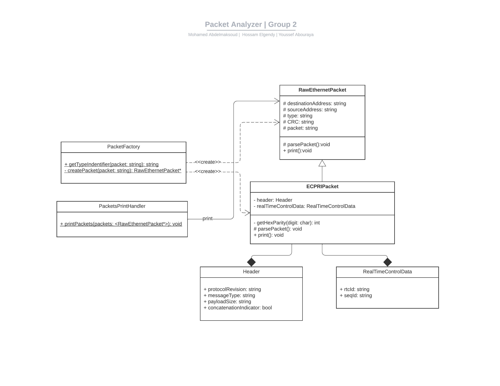

# Packet Analyzer: README

## Overview

The Packet Analyzer is a C++ project designed to parse and analyze network packets, particularly focusing on Ethernet and eCPRI packets. Given an input file containing raw packet data, the analyzer parses each packet, extracting relevant fields and producing a structured output for further analysis or debugging. The solution adheres to Object-Oriented Programming (OOP) principles, encapsulating packet-related logic within dedicated classes and utilizing a factory design pattern for object creation.

## Running the App

1. Put your input in [input_packets](input_packets) file.
2. Run the Application either from your C++ IDE or from the executable file provided [PacketParser.exe](PacketParser.exe).
3. That's it! Your output will appear in a file named `my_output_packets`.
## UML CLass Diagram

## Design Patterns and Principles

### Factory Design Pattern

Used in `PacketFactory`, this design pattern allows the program to instantiate objects of `RawEthernetPacket` or `ECPRIPacket` based on the input packet data, abstracting the creation logic from the client code (main application logic). This ensures that the main application logic is decoupled from the specific packet classes, enhancing maintainability and scalability.

### Object-Oriented Principles
- **Abstraction**: The corresponding class abstracts the details of parsing packets, providing a simple interface via public methods and utilizing private methods and attributes to hide the internal logic.
- **Inheritance**: `ECPRIPacket` inherits from `RawEthernetPacket`, reusing common parsing logic and ensuring a consistent interface for all packet objects.
- **Encapsulation**: Each class (e.g., `RawEthernetPacket`, `ECPRIPacket`) encapsulates specific logic related to its packet type, hiding the internal implementation and exposing only relevant methods and attributes.
- **Polymorphism**: The `print()` method in `ECPRIPacket` is an example of polymorphism as it overrides the method in the base class `RawEthernetPacket`.
## Classes and Files

### PacketFactory

#### [PacketFactory.cpp](PacketFactory.cpp), [PacketFactory.h](PacketFactory.h)

- **Purpose**: Implements the Factory Design Pattern to create packet objects based on input data type.
- **Key Methods**:
  - `createPacket(const string&)`: Determines the packet type and returns a corresponding packet object, ensuring the appropriate parsing logic is applied.

### RawEthernetPacket

#### [RawEthernetPacket.cpp](RawEthernetPacket.cpp), [RawEthernetPacket.h](RawEthernetPacket.h)

- **Purpose**: Represents a basic Ethernet packet and handles the parsing of common fields.
- **Key Methods**:
  - `parsePacket()`: Extracts and stores common fields like destination address, source address, type, and CRC from the raw packet data.
  - `print()`: Outputs the parsed packet data, adhering to a specific format.

  
### ECPRIPacket

#### [ECPRIPacket.cpp](ECPRIPacket.cpp), [ECPRIPacket.h](ECPRIPacket.h)

- **Purpose**: Represents an eCPRI packet, inheriting from `RawEthernetPacket` and extending the parsing logic for eCPRI-specific fields.
- **Key Methods**:
  - `parsePacket()`: Extends the base method to parse eCPRI-specific fields, storing them for subsequent access and analysis.
  - `getHexParity(char)`: Determines the parity of a hexadecimal digit to get the LSB (Least Significant Bit). Primarily used to get the `Concatenation Indicator` bit.
  - `print()`: Outputs the parsed packet data, adhering to a specific format.

### PacketsPrintHandler

#### [PacketsPrintHandler.h](PacketsPrintHandler.h)

- **Purpose**: Manages the printing of parsed packet data, providing a structured output.
- **Key Methods**:
  - `printPackets(const vector<RawEthernetPacket*>&)`: Iterates through a vector of packet objects, invoking their printing logic and outputting structured data.

### Main Application Logic

#### [main.cpp](main.cpp)

- **Purpose**: Serves as the entry point of the application, orchestrating the parsing and printing logic.
- **Flow**:
  1. Reads raw packet data from input_packets file.
  2. Utilizes `PacketFactory` to create packet objects.
  3. Stores packet objects in a vector.
  4. Utilizes `PacketsPrintHandler` to output parsed packet data into my_output_packets file.

---
